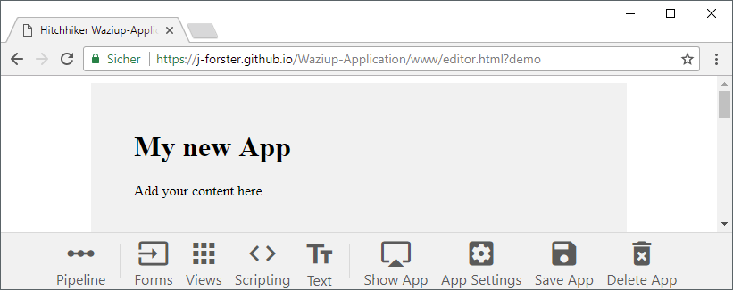
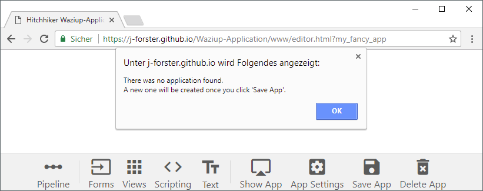
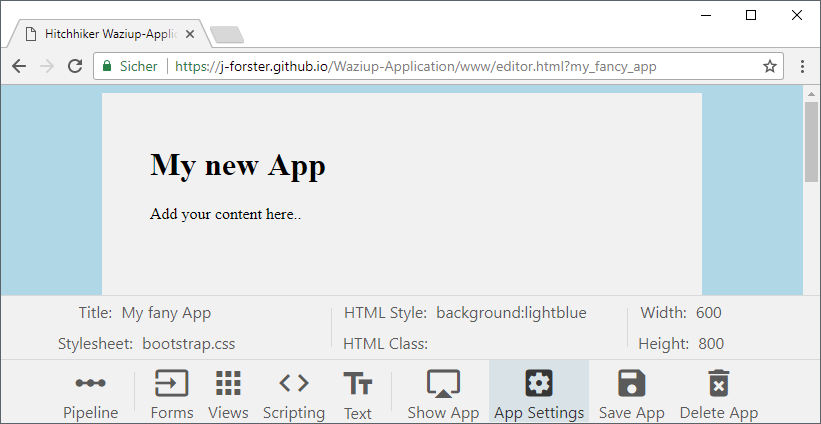

# Hello World!

This is a drag'n'drop application editor for the IoT and big data platfrom [Waziup.io](http://www.waziup.io/).
Use it for easy and fast creation of dashboards for various applications. Its an application that helps you make your own application, fancy huh?

### The Editor

Let's have a look at the editor.

[](https://j-forster.github.io/Waziup-Application/www/editor.html?demo)

This the editor. it corresponds with the application you are currently creating. Just change the URL from [editor.html?demo](https://j-forster.github.io/Waziup-Application/www/editor.html?demo) to [index.html?demo](https://j-forster.github.io/Waziup-Application/www/index.html?demo) and it will display the application without the editor toolbar. You can do that with any application, if you have the permissions to do so.

To create a new application, start with a new name like [editor.html?my_fancy_app](https://j-forster.github.io/Waziup-Application/www/editor.html?my_fancy_app). Click **OK** to continue.



You should now define the basic configuration, like title, width and height. Click on **App Settings** and set at title or a external stylesheet. Changes will apply instantly, but won't be saved until you click **Save App**.



Now it's time to change the 'My net App' text. Click on this control and a control-specific toolbar will show up. With the **Edit Text** button you can change the text. Dont worry, you don't need to create HTML. We use simple *Markdown* for this.

```markdown
# My new App
Add your content here..

```

If you are not familiar with markdown, give a look at GitHubs ['Mastering Markdown'](https://guides.github.com/features/mastering-markdown/) tutorial.

When you done, click **Save App** and **Show App**. It will open in a new tab.

---------------------------------

Next chapter: [▶ Pipelines](pipeline.md)