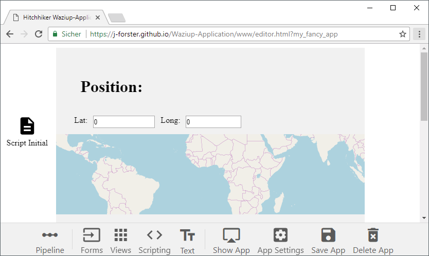
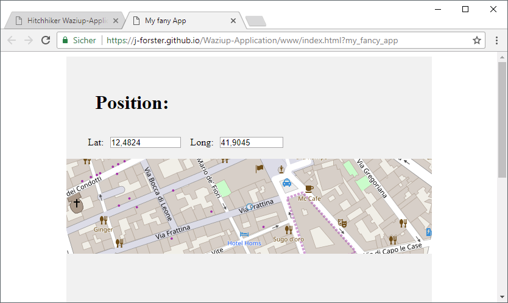

# Advanced Piplines

### Multi Level Pipelines

Pipelines are multi level object. For example, a pipeline can hold the following object:

```javascript
{
  latitude: 12.4824,
  longitude: 41.9045
}
```

Let's create an application, that can show the position on a map and allows the user to view the lat/long values.
We can reuse the input files from the last application for the lat/long fields.
The object above will be our pipeline, so the pipeline names are `position.latitude` and `position.longitude` for the input fields and `position` for the map.

Element | Pipeline
--------|----------
Number (Input) | `position.latitude`
Number (Input) | `position.longitude`
Map | `position`

As the pipeline will be empty by default, we should fill it with some initial position values.
You can use a **Script initial** element and define its content to ...

```javascript
({
  latitude: 12.4824,
  longitude: 41.9045
})
```

... and set the pipeline to `position`. When the application starts, the *Script initial* element loads its contents into the pipeline and thus filling it with some initial data.

Element | Pipeline
--------|----------
Script initial | `position`

Don't worry, the *Script initial* element is hidden in the application!

That's what the application looks like in the editor:



And that's the running application:



Click on the map and you will see, that the position changes. The map can reflect the position into the pipline as well!
Now you can use the numeric input fields and the map to change the position.

When you are done playing with the pipeline, continue with the next chapter.

---------------------------------

Next chapter: [▶ Ajax & Fetch](fetch.md)